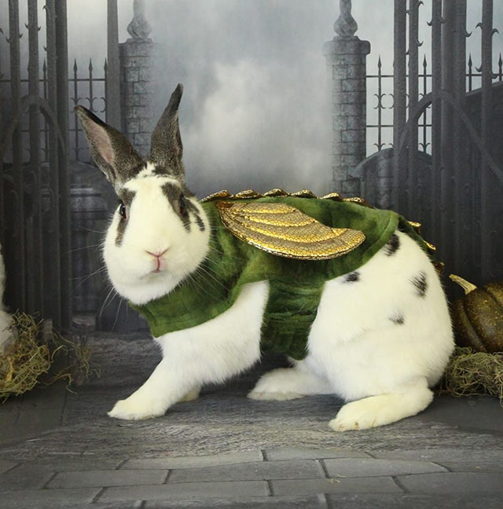
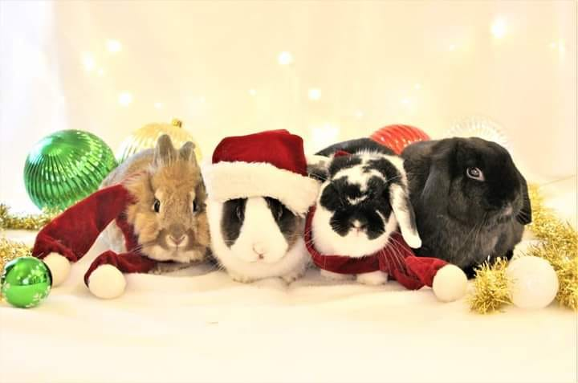
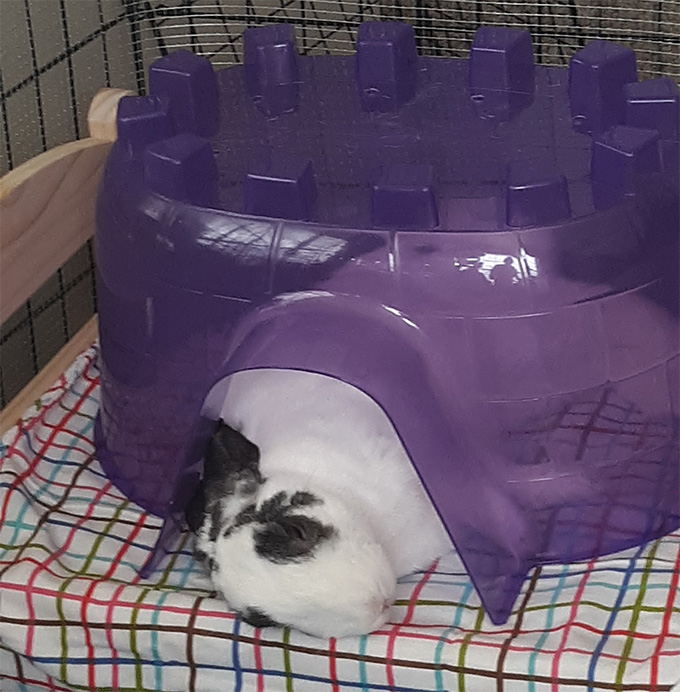

<head>
<!--<!doctype html>-->
<html>
<meta charset="utf-8">
<!--</head>-->

<body>
	<h1>Rabbits</h1>
	<h2>A fluffle of fun!</h2>
	<!--Fun with rabbits-->
	 
	 
	
Having a rabbit as a pet is the most entertaining thing ever.

	
	 
	<i>For Halloween, Ziggy wanted to be a dragon.</i>
	 
	 
	
If they'll let you, you can put cute costumes on them!

	 
	<h3>A group is exciting, especially for the holidays.</h3>
	 
	
	 
	<b>Tara's buns Kelly, Booplesnoot, Holly, and Snoop.</b>
	 
	 
	
	 
	
And after a long day of play, it's time for some rest.

	 
</body>
</html>
